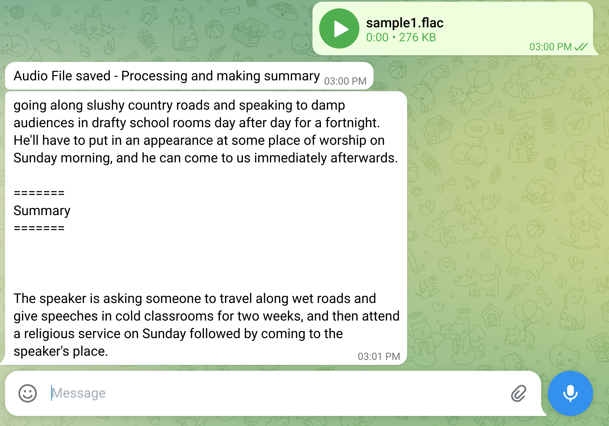
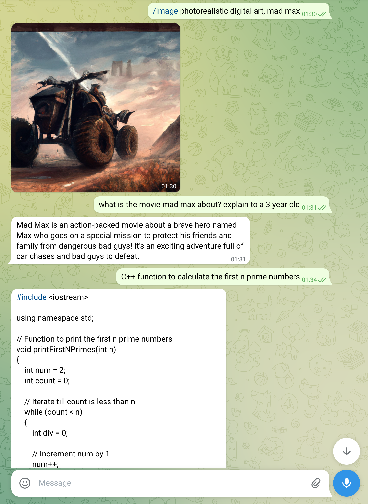

# telegram_bot_ai

Telegram bot that uses AI tools for chat, image and audio

# Dependencies

 - [python-telegram-bot](https://github.com/python-telegram-bot/python-telegram-bot)
 - [openai](https://github.com/openai/openai-python)
 - [whisper](https://github.com/openai/whisper)
 - [vit-gpt2](https://huggingface.co/nlpconnect/vit-gpt2-image-captioning)
 - [A telegram bot with API Key](https://core.telegram.org/bots/tutorial)
 - [An OpenAI API Key](https://elephas.app/blog/how-to-create-openai-api-keys-cl5c4f21d281431po7k8fgyol0)

# Functions

 - [x] Instruction chat with bot (through [openai davinci](https://beta.openai.com/docs/models/overview))
 - [x] Image generation (through openai [DALLE](https://beta.openai.com/docs/guides/images/introduction), trigger with `/image`)
 - [x] Voice message transcription and summary (through [openai whisper](https://huggingface.co/openai/whisper-small) + [davinci](https://beta.openai.com/docs/models/overview))
 - [x] TLDR summarization for many text sources (pdf, docx, pptx, webpages through url, txt)
 - [x] Image to Text Capitoning using [vit-gpt2](https://huggingface.co/nlpconnect/vit-gpt2-image-captioning)
 - [ ] Generate [stories](https://github.com/cheuerde/story_generator)
 - [ ] Text to speech (read stories) - would love to use [tortoise-tts](https://github.com/neonbjb/tortoise-tts)

# Usage

```sh
export TELEGRAM_API_KEY="your_telegram_api_key"
export OPENAI_API_KEY="your_openai_api_key"

python3 bot.py
```

# Screenshots 




